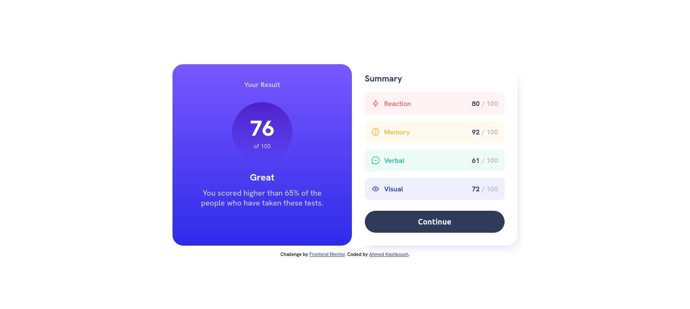
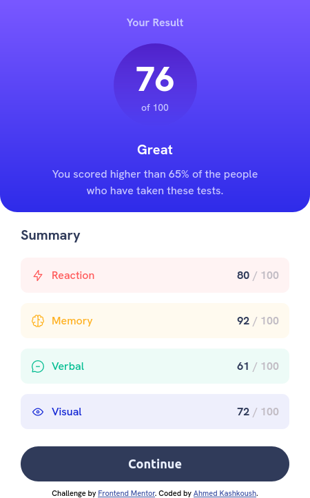

# Frontend Mentor - Results summary component solution

This is a solution to the
[Results summary component challenge on Frontend Mentor](https://www.frontendmentor.io/challenges/results-summary-component-CE_K6s0maV).
Frontend Mentor challenges help you improve your coding skills by building
realistic projects.

## Table of contents

- [Overview](#overview)
  - [The challenge](#the-challenge)
  - [Screenshot](#screenshot)
  - [Links](#links)
- [My process](#my-process)

  - [Built with](#built-with)
  - [Continued development](#continued-development)

- [Author](#author)

## Overview

### The challenge

Users should be able to:

- ✅ View the optimal layout for the interface depending on their device's
  screen size
- ✅ See hover and focus states for all interactive elements on the page

### Screenshot

### Links

- Solution URL:
  [Github Repo](https://github.com/ahmad-kashkoush/Result-summary-component)
- Live Site URL:
  [Live Demo](https://ahmad-kashkoush.github.io/Result-summary-component/index.html)

## My process

### Built with

- Semantic HTML5 markup
- CSS custom properties
- Flexbox
- Mobile-first workflow

### Continued development

Next Time I'll use **Mobile-first workflow** Because I've tried it and it is
very helpful 🚀

## Author

- Website - [Ahmed Kashkoush](https://github.com/ahmad-kashkoush)
- Frontend Mentor -
  [@Ahmed_Kashkoush](https://www.frontendmentor.io/profile/ahmad-kashkoush)
